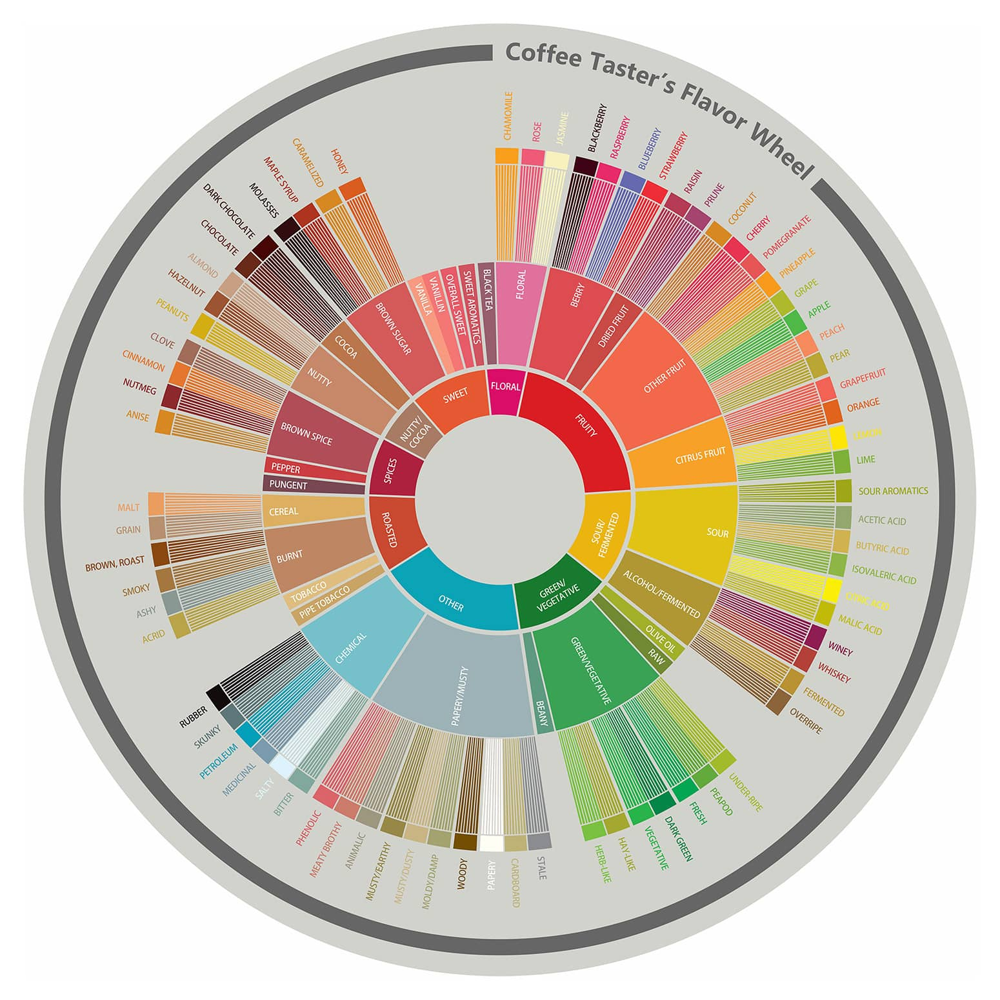

 The world of coffee - like everything in food and beverage - is constantly evolving. Your morning cup of Folgers or Nescafe has fallen out of favor; much like the Jello molds or *Insert something here* of yesteryear. Most modern coffee drinkers expect a higher quality cup than what you can get out of a Mr. Coffee drip machine loaded with a couple spoonfuls from your favorite canister of pre-ground beans. 

The rise of pour over coffee stems from the belief that coffee can be more than just something you drink in the morning to get yourself going. The third wave coffee movement was this shift - we’re not as excited about diner coffee or roasts that are borderline charcoal. We want cool single origins (although blends certainly have their place), lighter roasts, we want coffee that gives us flavors that aren’t “smoke” or “cacao.”

Pour over coffee has been around for decades but has only recently gained the prominence that it deserves. The creation of a few foundational drippers along with a boom in roasters that focused on light roast, single origin coffees created a perfect storm to birth this movement. Coffee didn’t have to have the same boring tasting notes. 

These days, we have a whole wheel to represent all of those interesting coffee flavors.

But this comes with its own price. Pour over is coffee at a higher level - one with tasting notes, detailed instructions, and a vocabulary so expansive you might need to keep a pocket notebook on you to keep track of the new terms that continuously pop up. New gadgets are always being released, articles written, all chasing the best possible cup of coffee.

But at the end of the day, you don’t need to care that much about any of this to get a truly good cup of coffee. The pour over process can be as complicated or as simple as you’d like. 

<h2>What is a pour over, anyway?</h2>
A pour over is a manual brewing method where you’re doing the hard work of pouring the water over the coffee. This gives you a lot of control over every step of the brew - which is how you can get such a great cup. Every variable can be accounted for, which makes all the difference.

But it’s also the trickiest part. When you have such a wide breadth of variability, it leaves you with a lot of decisions to make. What brewer should you use? What should you set the water temperature at? Should you go for low or high agitation when pouring?

All of these factors do have an impact on the final taste - some more so than others. 

For an at-home or beginner brewer, this can sound daunting. But rest assured, you can still make a great cup of coffee without having to worry about all of this - we can break down the process into a few easy steps.

<h2>Pourover Steps</h2>
<h3>Grind Your Coffee</h3>
Pick a medium size grind on your grinder (which you own, right?) and try it out. Adjustments can be made later, depending on your brew performance and taste preferences. 
<h3>Heat Your Water</h3>
It doesn’t matter how you do it, although an electric gooseneck kettle is the preferred way to go. Somewhere between 195°-205° is generally the recommended temperature to brew at, but going above or below certainly isn’t unheard of. 
<h3>The Bloom</h3>
Hey, that’s our namesake! 

The bloom is a stage in the process where you get all of the coffee grounds wet and allow them to expand to release the CO2 in them. It leads to better saturation of the grounds later in the process, since all of that CO2 isn’t blocking you from extracting the flavor compounds you’re so desperately after. 
<h3>Start Your Pours</h3>
A number of factors can impact how you want to set up your pours. You can do 50g, 100g, or even a full 350g pour - just depending on how you’re feeling.

Alongside the amount, you always should be pouring in circles, starting from the inside to outside of the grounds. This ensures a more even brew. 

As long as you follow this formula, feel free to experiment as much as you want! Adjust all the variables your heart desires until you get a great cup. Don’t get discouraged if your first (or second, or third…) pour over isn’t where you want it to be yet. It takes practice to perfect your personal techniques. 

Or, if you don’t feel like putting in all of the effort into trying to get it, we always have a solid list of pour over options at Bloom - where we’ve done all of the work for you. All you have to do is sit back and enjoy! 

